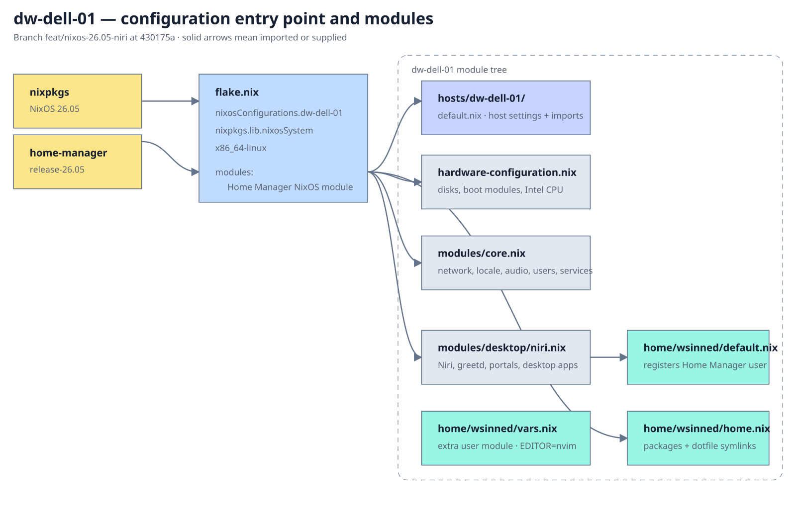

# nix-config

Minimal NixOS 26.05 configuration for `dw-dell-01`, using Niri on Wayland.

## Dotfiles

Application configuration remains in the separate
[`tech-notes`](https://github.com/wsinned/tech-notes) repository. Home Manager
creates out-of-store symlinks to that checkout, so the files:

- remain editable;
- are not duplicated in this repository or the Nix store;
- can be shared by NixOS and non-NixOS machines;
- can have a lifecycle independent from the operating-system configuration.

Clone both repositories at their standard locations before activating:

```bash
git clone https://github.com/wsinned/nix-config ~/nix-config
git clone https://github.com/wsinned/tech-notes ~/tech-notes
```

The shared desktop configuration currently links Niri, Waybar, Mako, Foot,
swaylock, Vicinae, Wallust, Yazi, Neovim and the common scripts directory.
Machine-specific behaviour should remain in the NixOS host module or be guarded
by hostname in the shared dotfile.

The current Niri file still contains an `eDP-1` mode for the source laptop and
an Arch-specific PolicyKit startup command. NixOS starts PolicyKit separately,
so that command merely becomes redundant. For long-term portability, remove the
output block from the shared file and keep monitor settings in device-specific
Niri fragments or an output-management tool.

## Install

The committed `dw-dell-01` hardware profile contains disk UUIDs from the previous
installation. During a fresh installation, replace it with the profile generated
for the actual disk layout:

```bash
sudo nixos-generate-config --root /mnt
cp /mnt/etc/nixos/hardware-configuration.nix \
  ~/nix-config/hosts/dw-dell-01/hardware-configuration.nix
```

Then install:

```bash
sudo nixos-install --flake ~/nix-config#dw-dell-01
```

After the first boot, join the machine to the tailnet interactively:

```bash
sudo tailscale up
```

The configuration deliberately does not commit a reusable Tailscale auth key.
For unattended provisioning, supply an ephemeral or pre-authorised key at
deployment time through a secrets mechanism rather than the Nix store.

## Test changes

```bash
sudo nixos-rebuild dry-build --flake .#dw-dell-01
sudo nixos-rebuild test --flake .#dw-dell-01
sudo nixos-rebuild switch --flake .#dw-dell-01
```

Update pinned inputs deliberately:

```bash
nix flake update
sudo nixos-rebuild test --flake .#dw-dell-01
```

## Nix Architecture


